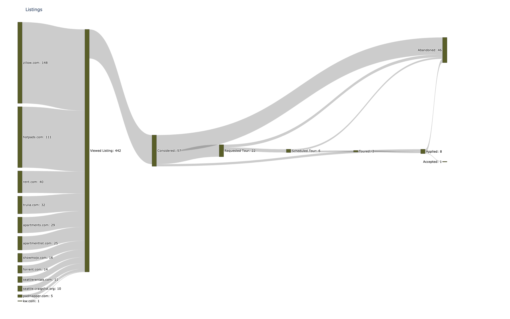

# House Search 2021

Scan Google Chrome browser history for real estate sites and use to build a sankey diagram.

Usage:

```
./generate-sankey.py \
    --plotly-username=XXXXXXXXXX \
    --plotly-api-key=XXXXXXXX \
    --plotly-chart-name=XXXXXXXX \
    --publish-to-plotly \
    --png-file-path=$PWD/home-search-sankey.png \
    --html-file-path=$PWD/home-search-sankey.html \
    --chrome-sqlite-browser-history-path=$HOME/Application Support/Google/Chrome/Default/History

```

Produces:



[and an interactive version](home-search-sankey.html)
